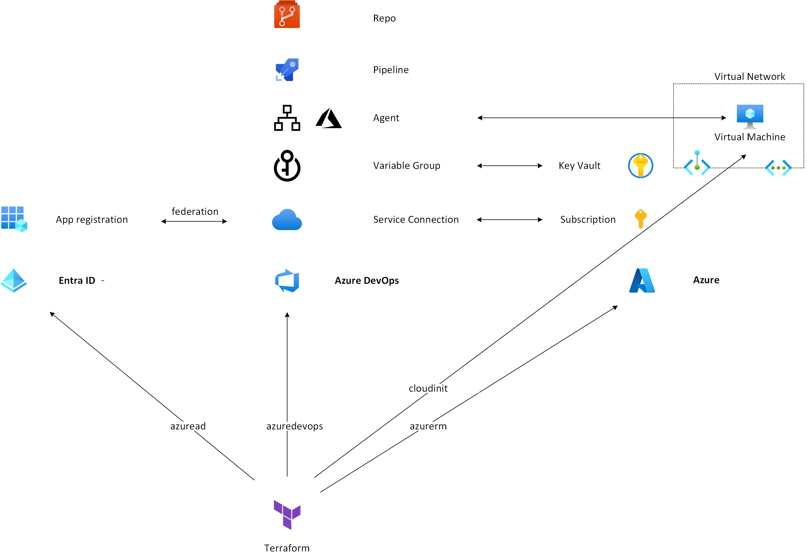

# Demo deployment

This repo uses Terraform with the [azuread](https://registry.terraform.io/providers/hashicorp/azuread/latest/docs), [azuredevops](https://registry.terraform.io/providers/microsoft/azuredevops/latest/docs) and [azurerm](https://registry.terraform.io/providers/hashicorp/azurerm/latest/docs) providers to create an end-to-end sample. It assumes you are proficient with Terraform.

<p align="center">

</p>

## Terraform input variables

By default, this repo will allow inbound access from all Azure DevOps geographies (including ExpressRoute). To override the default and constrain inbound access to a single geography, see [variables.tf](terraform/variables.tf) for a list of Terraform variables.

Key variables are:

#### Specify Azure DevOps geography

```hcl
azdo_geography = 'us' 
```

Not setting this variable will allow access from all regions and ExpressRoute.

#### Specify Azure DevOps project

By default, this demo will create a new project. 

```hcl
azdo_project = '<name of project>' 
```

To use an existing project, specify an existing project name and:

```hcl
create_azdo_resources = true 
```

#### Specify Azure region

To specify the Azure region for Key Vault and Self-hosted agent, specify:

```hcl
azure_location = "westeurope" 
```

#### Enable or disable components

The following skips creating a repo with a YAML pipeline:

```hcl
create_azdo_pipeline = false 
```

Use an existing Azure DevOps project instead of creating a new one:

```hcl
create_azdo_resources = false 
```

Deploy an Azure Bastion to access a Self-hosted agent:

```hcl
create_azure_bastion = true 
```

Allow unconstrained public access to the Key Vault:

```hcl
enable_azure_key_vault_public_access = true 
```

Use Azure RBAC instead of access policies to authorize access to Key Vault:

```hcl
use_azure_key_vault_aad_rbac = true 
```